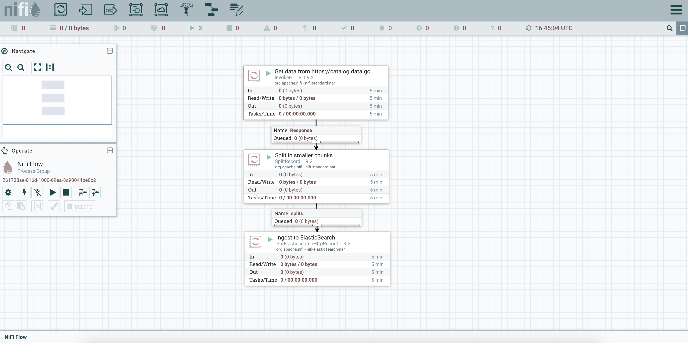
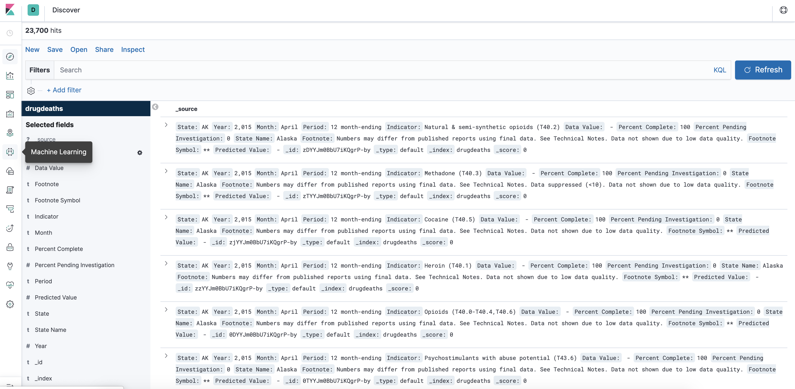
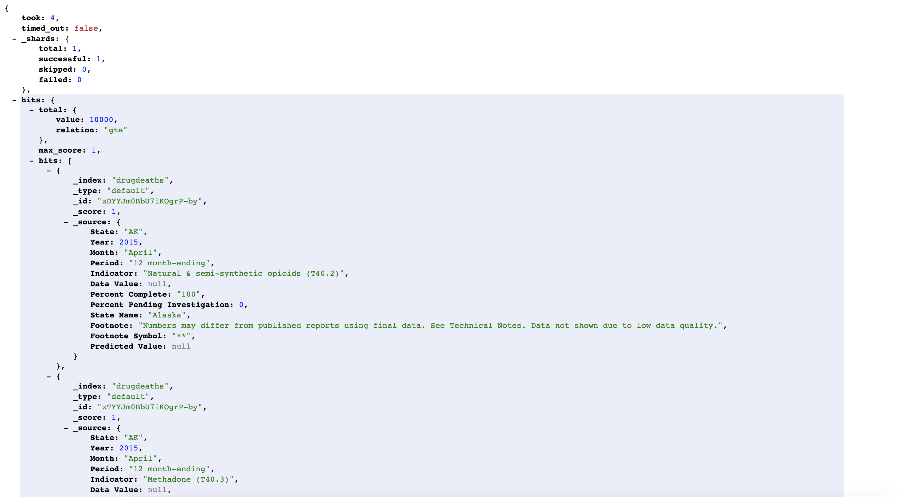

# Nifi-Docker workflow to index public data.gov CSV data to ElasticSearch/Kibana without downloading or converting anything upfront
This Nifi workflow will pull down the VSRR Provisional Drug Overdose Death Counts CSV file with over 23,000 records from here https://catalog.data.gov/dataset/vsrr-provisional-drug-overdose-death-counts-54e35 (at the time of creation 9/2019 this was the media download link https://data.cdc.gov/api/views/xkb8-kh2a/rows.csv?accessType=DOWNLOAD), transform the CSV to JSON, and load the data unaltered otherwise into an ElasticSearch index. Everything in a few simple steps and running in a Docker environment.

## Prerequisites
- Docker is required with increased memory, the default settings are too low for this setup (2GB are the default, 6GB are required to run this demo); detailed instructions how to increase Docker memory settings: https://stackoverflow.com/questions/44533319/how-to-assign-more-memory-to-docker-container

## Disclaimers
- This was developed on Mac with Docker version 19.03.2
- The docker-compose.yml setup is not production ready, only for testing and development

## Steps

### Spin up Docker containers with Nifi/ElasticSearch/Kibana environment
- From project folder, run `docker-compose up -d` (this can take some time initially if the required Nifi, ElasticSearch, and Kibana Docker images have to be downloaded first; also, on Windows, it may fail or hang and the command has to be repeated until the containers have been started)

### Pull up Nifi UI 
- Go to `http://localhost:8080/nifi` in browser window, this can take some time (30 seconds up to 2 minutes after container has been started), so keep refreshing the URL until the nifi canvas pops up

### Explore ElasticSearch in docker container 
- Once booting is done, open `http://localhost:9200/` in new browser window and confirm ElasticSearch is up and running in Docker (this can also take some time after spinning up the environment with `docker-compose up -d`)

### Import `drug_overdose_death_counts.xml` into nifi
- See here how to import a nifi template into the nifi canvas: https://nifi.apache.org/docs/nifi-docs/html/user-guide.html#Import_Template and import `drug_overdose_death_counts.xml` from project directory into nifi
- Once template is imported, unselect everything by clicking anywhere on the canvas
- Then right-click anywhere on canvas, hit 'Configure', select tab 'CONTROLLER SERVICES', and enable all controller services by clicking on the litte thunder icons, and exit out of that view to get back to the nifi canvas

### Run nifi template
- On the left side of canvas in 'Operate' box, click 'Play' icon to start workflow
- Right-click anywhere on canvas and hit 'Refresh' to see workflow progress
- Once finished, go back to browser window with the ElasticSearch index and enter this URL `http://localhost:9200/drugdeaths/_search?q=*&size=500` and you should see a whole bunch of JSON objects

### Query index called 'deathcounts'
- See available indexes: `http://localhost:9200/_cat/indices`
- See individual JSON object count of index: `http://localhost:9200/drugdeaths/_count`
- See 500 randomly selected objects: `http://localhost:9200/drugdeaths/_search?q=*&size=500`
- Query for string value 'heroin': `http://localhost:9200/drugdeaths/_search?q=heroin&size=500`
- Query with key/value pair: `http://localhost:9200/drugdeaths/_search?q=State:OK`
- etc.

### More advanced: query/visualize/analyze index called 'drugdeaths' in Kibana
- Pull up Kibana UI here http://localhost:5601

### Stop Docker containers but **PERSIST** ElasticSearch index data
- Run `docker-compose stop`; to restart environment rerun `docker-compose up -d` (takes some time again to make URLs available)

### Shut down environment and **REMOVE** Docker containers and data volumes once finished
- Run `docker-compose down -v`

Nifi canvas:

Kibana UI:

ElasticSearch browser view:

